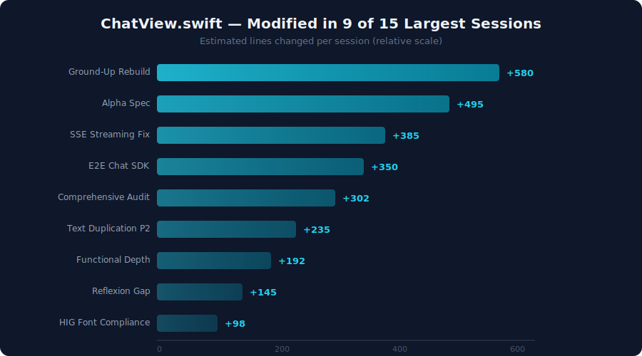
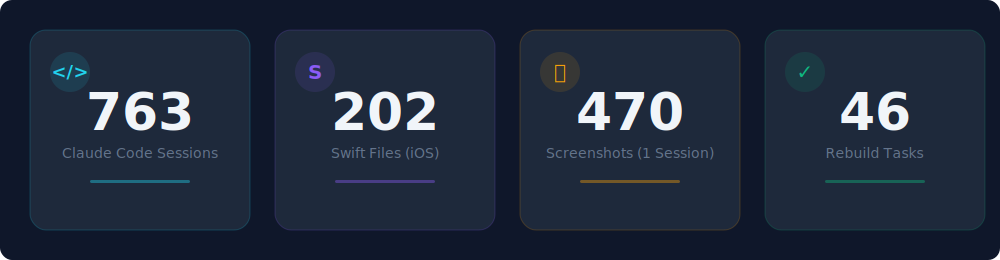

# Building a Native iOS Client for Claude Code

*How a 5-layer streaming bridge, 763 Claude Code sessions, and one two-character bug turned a CLI tool into a SwiftUI app.*

---

There is a particular kind of ambition that sounds reasonable in the abstract and reveals itself as borderline reckless in practice: build a native iOS client for a tool that was designed to live in a terminal. Claude Code reads stdin, writes stdout, and streams Server-Sent Events through localhost HTTP. Nothing about it implies a phone screen. I built ILS anyway -- an Intelligent Local Server that wraps Claude Code in a full SwiftUI interface, powered by a Vapor backend, a Python SDK bridge, and an unreasonable tolerance for debugging serialization layers.

Over 90 days, across 763 Claude Code sessions generating 1.34GB of JSONL conversation data, ILS grew into 149 Swift files on the iOS side, 52 in the backend, 26 shared models, 24 screen directories, 12 hand-tuned themes, and 13 backend controllers. This is the technical story of what it took to make real-time AI streaming feel native on iOS.

## The 5-Layer Architecture

The system architecture looks deceptively clean in a diagram:


In practice, each layer introduced failure modes that the layer above could not distinguish from its own bugs. Here is the full path a single chat message traverses:

1. **SwiftUI ChatView** -- user taps send, `ChatViewModel` fires
2. **APIClient** -- `POST /api/v1/chat/stream` to localhost:9999
3. **Vapor Backend** -- `ChatController` routes to `ClaudeExecutorService`, which spawns a `Process`
4. **Python SDK Wrapper** -- `sdk-wrapper.py` calls `claude_agent_sdk.query()` with `include_partial_messages=True`
5. **Claude CLI** -- the SDK invokes the Claude Code binary, which makes HTTPS calls to the Anthropic API

Responses travel the entire path in reverse: Anthropic API streams tokens to Claude CLI as NDJSON chunks, the Python wrapper filters and re-emits them on stdout, the Vapor backend converts them to SSE events, the iOS `SSEClient` parses them into Swift structs, and `@Observable` triggers a SwiftUI re-render. Token by token.

Six serialization boundaries. Five processes. Four programming languages. Three streaming protocols. One app that needs to feel instant on a phone.

The Vapor backend runs on port 9999. This is not arbitrary -- port 8080 belongs to another project (ralph-mobile), and a backend binary mismatch early in development cemented the need for deliberate, documented port assignments. Every default port in localhost development is a future collision.

## The SSE Streaming Sequence

The real complexity lives in the streaming path. A single "Say hi" message triggers this sequence:


Three aspects of this flow caused the most pain: connection timeouts, event filtering, and text accumulation semantics.

### Two-Tier Timeouts

The first streaming implementation used a single timeout. Complex prompts where Claude needs 25 seconds to begin responding would kill the connection. Long responses that took 6 minutes would also kill the connection. The solution was a two-tier timeout with a heartbeat watchdog:

```swift
// SSEClient.swift — Two-tier timeout
let initialTimeout: TimeInterval = 30   // 30s to first byte
let totalTimeout: TimeInterval = 300    // 5min total session
```

Between these two boundaries, a `LastActivityTracker` actor monitors the stream. Every received chunk resets the heartbeat timer. If 60 seconds pass with no data, the connection is declared dead and the `ChatViewModel` transitions to a `connectingTooLong` state, surfacing a retry option to the user rather than silently hanging.

### The Text Duplication Bug (P2)

The most insidious streaming bug was a P2 that caused every streamed token to appear twice. Claude would respond "Hello" and the user would see "HelloHello". The root cause was a two-character difference:

```swift
// BEFORE (bug): appends to already-accumulated content
message.text += textBlock.text

// AFTER (fix): assignment — the assistant event is authoritative
message.text = textBlock.text
```

The `+=` versus `=` distinction matters because of how the Claude SDK reports content. Each `textDelta` event contains the *accumulated* text so far, not just the new token. The `assistant` message event carries the full response. Appending an already-accumulated string to itself produces exact duplication.

But fixing the append was only half the problem. A second cause lurked in the stream completion handler:

```swift
// BEFORE: replays all messages from index 0
self.lastProcessedMessageIndex = 0

// AFTER: preserves the high-water mark
let finalCount = sseClient.messages.count
self.lastProcessedMessageIndex = finalCount
```

When the stream ended, resetting `lastProcessedMessageIndex` to 0 caused the message processing loop to replay every message from the beginning, duplicating the entire conversation. Two bugs, same symptom, different layers. This is the signature pattern of multi-layer streaming architectures: a single user-visible problem with multiple contributing causes distributed across the stack.

## Four Failed Attempts Before the Bridge Worked

The 5-layer architecture was not the first design. It was the fifth.

**Attempt 1: Direct Anthropic SDK.** The obvious approach -- call Anthropic's API directly from Swift. Dead on arrival. The SDK requires an `ANTHROPIC_API_KEY`, which Claude Code authenticates through OAuth, not API keys. No key, no direct access.

**Attempt 2: ClaudeCodeSDK in Vapor.** Anthropic's `ClaudeCodeSDK` Swift package seemed purpose-built. It was not. The SDK internally uses `FileHandle.readabilityHandler` with Combine's `PassthroughSubject`, which requires `RunLoop` to pump events. Vapor runs on SwiftNIO event loops, which do not pump `RunLoop`. The publisher subscriptions silently never emitted. No errors, no crashes -- just an `AsyncStream` that never yielded.

**Attempt 3: JavaScript SDK.** The `@anthropic-ai/sdk` npm package had its own authentication issues and added a Node.js runtime to the dependency chain for no clear benefit.

**Attempt 4: Direct Process spawning of Claude CLI.** This worked in isolation but crashed inside active Claude Code development sessions due to nesting detection (more on this below).

**Attempt 5: Python SDK Wrapper.** The `claude-agent-sdk` Python package wraps Claude CLI, inherits its OAuth authentication, supports partial message streaming, and runs cleanly as a subprocess. Adding `sdk-wrapper.py` as a thin bridge between Vapor's `Process.spawn` and the actual SDK call was the design that stuck.

The lesson: when integrating with a tool that was built for CLI usage, the path of least resistance runs through a language ecosystem the tool already supports, not through native reimplementation.

## The Nesting Detection Wall

Claude Code includes a nesting detection mechanism. If you spawn Claude CLI from inside an active Claude Code session, environment variables (`CLAUDECODE`, `CLAUDE_CODE_*`) signal the parent process, and the child refuses to execute. This is sound defensive design -- recursive agent loops are a real risk. It is also a brick wall when your Vapor backend, running inside a Claude Code development session, needs to spawn Claude CLI as a subprocess.

The fix is surgical environment variable stripping:

```swift
// ClaudeExecutorService.swift — env var stripping for SDK nesting
var env = ProcessInfo.processInfo.environment
env.removeValue(forKey: "CLAUDECODE")
env = env.filter { !$0.key.hasPrefix("CLAUDE_CODE_") }
process.environment = env
```

This took an afternoon to diagnose because the symptom was "Claude CLI exits immediately with no output" -- no error, no stderr, just a zero-byte response that the NDJSON parser interpreted as an empty stream. The environment variable stripping is three lines of code. Finding those three lines cost a full session.

## The @Observable @MainActor Concurrency Dance

Swift's strict concurrency model -- trending toward full enforcement in Swift 6 -- creates a specific recurring friction point in SwiftUI apps that manage background streaming tasks.

The pattern: a `ChatViewModel` decorated with `@Observable @MainActor` holds a reference to a `Task` that streams SSE data in the background. The task must be cancellable. The reference must be mutable. Swift's concurrency checker objects to all of this.

After three failed approaches (normal property rejected because `deinit` is nonisolated; `nonisolated` property rejected because `@Observable` requires main actor isolation for stored properties), the working pattern emerged:

```swift
@Observable @MainActor class ChatViewModel {
    nonisolated(unsafe) var streamTask: Task<Void, Never>?

    deinit {
        streamTask?.cancel()
    }
}
```

`nonisolated(unsafe)` tells the compiler: "This property crosses isolation domains and I will manage synchronization manually." In practice, the property is only written from the main actor and only read from `deinit` for cancellation. The theoretical data race risk is minimal. This pattern appears in every view model that manages async work -- `ChatViewModel`, `SystemMetricsViewModel`, `TunnelSettingsViewModel`. It is the pragmatic bridge between Swift 5's flexibility and Swift 6's strictness.

## Auto-Build Hooks: Catching Errors in Real Time

One of the most effective development patterns was a `PostToolUse` hook that triggers `xcodebuild` automatically after every `.swift` file edit. The hook detects which target was modified and builds accordingly:

```
ILSApp/**/*.swift    -> xcodebuild ILSApp scheme (simulator)
ILSMacApp/**/*.swift -> xcodebuild ILSMacApp scheme (macOS)
Sources/**/*.swift   -> swift build (backend)
```

If the build fails, the hook outputs `BUILD FAILED ($SCHEME): <errors>` and halts further edits. The 30-second build cost per edit is dramatically cheaper than a 30-minute debugging session from batched changes that introduce cascading Swift compiler errors.

This hook fundamentally changed the development feedback loop. Instead of the traditional cycle of edit-edit-edit-build-debug, every edit is immediately validated. Errors surface within seconds of introduction, when the context of the change is still fresh. Over 763 sessions, this pattern prevented more bugs than any other single practice.

## ChatView: The Gravitational Center

One file absorbed more modification pressure than any other in the codebase. Out of the 15 largest sessions measured by file changes, 9 touched `ChatView.swift`.



ChatView is the gravitational center of the app: message rendering, SSE streaming state, permission request handling, token counting, elapsed time display, markdown rendering, code block syntax highlighting, and in-session search. Every feature eventually flows through chat. The Ground-Up Rebuild session alone contributed an estimated 580 lines of changes to this file. The SSE Streaming Fix, E2E Chat SDK, and Text Duplication P2 sessions each added hundreds more.

The mitigation was progressive decomposition. `MessageView` extracted message rendering. `AdvancedOptionsSheet` extracted model configuration. `ContextWindowDetailSheet` extracted token usage display. But ChatView remained large because its responsibilities -- managing the SSE connection lifecycle, coordinating between streaming state and UI state, handling the transition between queued and delivered messages -- are inherently coupled.

## The Numbers



The final accounting across 90 days of development:

- **763 Claude Code sessions** producing 1.34GB of JSONL data
- **149 Swift files** in the iOS app, **52** in the backend, **26** shared models
- **24 screen directories** in the Views layer
- **12 built-in themes** with a full theme editor (17 color tokens, 13 typography tokens, 10 spacing tokens, 8 radius tokens)
- **13 backend controllers** covering sessions, projects, chat, skills, MCP, plugins, config, stats, themes, system, teams, tunnel, and health
- **5 major validation phases**, each producing screenshot evidence (470 in the peak session)
- **46 rebuild tasks** completed with individual evidence verification
- **4 failed bridge attempts** before the Python SDK wrapper design succeeded
- **2 characters** (`+=` to `=`) that fixed the P2 text duplication bug

## What I Would Do Differently

**Start with the Python bridge.** I spent weeks trying to make native Swift integrations work before accepting that the path of least resistance runs through the SDK's native language. The 5-layer architecture looks complex, but each layer has a clear, debuggable responsibility. The "simpler" designs that eliminated layers were the ones that never worked.

**Instrument the stream from day one.** The text duplication bug survived three sessions before being caught because there was no logging at the message accumulation boundary. Adding structured logging at each serialization boundary -- what went in, what came out, how many bytes -- would have reduced diagnosis time from hours to minutes.

**Two-tier timeouts are not optional.** Any streaming connection needs both a "has anything started?" timeout and a "is the total duration reasonable?" timeout. A single timeout value cannot serve both purposes. This applies beyond SSE -- any long-lived connection benefits from this pattern.

**Document your ports.** Every localhost service needs an assigned port documented in a single file. The cost of a port collision is hours of debugging symptoms that look like serialization bugs. `lsof -i :PORT -P -n` should be muscle memory.

**Accept that ChatView will be large.** Not every file can be decomposed into small, focused units. A real-time streaming chat interface has inherently coupled responsibilities. Extracting subviews helps, but the coordination logic stays. Design for readability within the file rather than fighting to shrink it.

---

ILS ships as a native iOS and macOS app. The Vapor backend bridges Claude Code's CLI-native architecture into Apple's SwiftUI ecosystem. The Python SDK wrapper handles the API communication. It is four languages, five processes, six serialization boundaries, and an unreasonable number of evidence screenshots.

It works. And the next time Claude Code streams a response to my phone -- each token arriving as an SSE event that traversed five process boundaries to get there -- I will know exactly which layer to blame when it breaks.

*Nick Krzemienski builds AI-native developer tools. ILS is available for iOS and macOS.*

---

## Companion Repository

**[`claude-ios-streaming-bridge`](https://github.com/krzemienski/claude-ios-streaming-bridge)** — Reusable Swift Package + Python bridge for iOS/macOS Claude Code streaming

---

*Part 1 of 10 in the **Agentic Development** series — [View all posts](https://github.com/krzemienski/agentic-development-guide)*

*Nick Krzemienski — March 2026*
