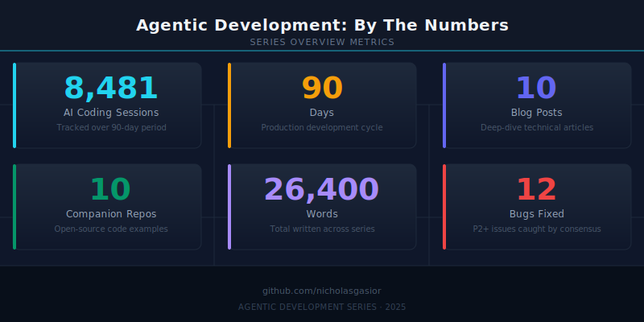

## 8,481 AI Coding Sessions. 90 Days. Here Is What I Learned.

8,481 AI coding sessions. 90 days. 5.5 GB of interaction data. 10 blog posts. Here is what I learned building software almost entirely with AI coding agents.

Not the "ask ChatGPT to write a function" kind of AI-assisted development. The "coordinate 30 specialized agents working in parallel across a shared codebase, with hard consensus gates that block shipping until three independent reviewers agree" kind.

I spent the last three months building real products -- a native iOS client for Claude Code, a Rust orchestration platform, an audio story generator, a design-to-code pipeline -- and documenting every pattern, failure, and architecture decision along the way. The result is 10 deeply technical blog posts totaling 22,489 words, backed by 33 Mermaid diagrams, 10 data visualizations, and code from 10 companion repositories that all went through a four-phase audit: structural review, functional validation with real execution, documentation completeness, and SDK compliance. 12 bugs were found and fixed across those repos before publication. Every code snippet comes from production. No fabricated examples.

Here are all 10 topics and why each one matters.

---

### Topic 1: Building a Native iOS Client for Claude Code

763 sessions building a SwiftUI app with a 5-layer streaming bridge. The architecture runs SwiftUI frontend to Vapor backend to Python SDK wrapper to Claude CLI to Anthropic API. Each token traverses this entire chain as a Server-Sent Event. The total path from API response to rendered pixel: roughly 50ms per token. The companion repo (`claude-ios-streaming-bridge`) ships as a reusable Swift Package with an SSEClient that handles UTF-8 buffer parsing, exponential backoff reconnection, and a complete type system -- `StreamMessage`, `ContentBlock`, `StreamDelta`, `UsageInfo`. The two-character bug that stopped every token from appearing twice lives in this post. More on that in Topic 4.

---

### Topic 2: The 5-Layer Bridge -- 4 Failed Attempts, 1 Working Architecture

A debugging war story. Direct Anthropic API from Swift -- failed, no OAuth token available. JavaScript SDK via Node subprocess -- failed, NIO event loops do not pump RunLoop. Swift ClaudeCodeSDK in Vapor -- failed, `FileHandle.readabilityHandler` needs RunLoop which NIO does not provide. Direct CLI invocation -- failed, nesting detection blocks Claude inside Claude. The fifth attempt worked: a Python subprocess bridge with NDJSON stdout and environment variable stripping (specifically removing `CLAUDECODE=1` and `CLAUDE_CODE_*` vars before spawning). The counterintuitive lesson is that the 5-layer architecture is simpler than any of the "simpler" approaches because each layer does exactly one translation with exactly one failure mode.

---

### Topic 3: Spawning 194 Parallel Git Worktrees

Factory-scale AI development. 194 isolated git worktrees, each running its own AI coding agent, all building the same codebase in parallel. The pipeline has four stages: spec generation, worktree provisioning with parallel execution, independent QA review, and merge queue processing. The companion repo (`auto-claude-worktrees`) is a pip-installable Click CLI with a priority-weighted merge queue and stale worktree detection. The numbers: 91 specs generated, 71 QA reports produced, 3,066 sessions total. The key insight is that the QA pipeline matters more than the agents themselves -- the rejection-and-fix cycle between independent QA agents and executors is where the real quality comes from.

---

### Topic 4: How 3 AI Agents Found a Bug I Would Have Shipped

Multi-agent consensus. A single agent reviewed my streaming code and said "looks correct." Three agents running a structured consensus audit caught a P2 bug on line 926 of `ChatViewModel.swift` in the first pass. The bug: `message.text += textBlock.text` when it should have been `message.text = textBlock.text`. One character. The `+=` appended to already-accumulated content. The `=` treats each event as authoritative. A second root cause compounded it -- the stream-end handler reset `lastProcessedMessageIndex` to zero, replaying the entire buffer. The three-agent pattern uses Lead (architecture and consistency), Alpha (code and logic), and Bravo (systems and functional verification). They vote independently. Unanimous pass required. I have run this across 3 projects with 10 blocking gates each. Cost per gate: roughly $0.15. The P2 bug would have shipped to users.

---

### Topic 5: The 7-Layer Prompt Engineering Stack

Defense-in-depth for AI coding agents. Layer 1: `CLAUDE.md` global rules loaded into every session. Layer 2: `.claude/rules/` with project-specific instructions -- build commands, architecture patterns, feature gates. Layer 3: 150+ reusable skills invoked by name. Layer 4: hooks that auto-build after every `.swift` file edit and pre-commit security scans that block API keys (`sk-*`, `AKIA*`, `ghp_*`) and database files from being committed. Layer 5: 25+ specialized agent definitions with scoped prompts and tools. Layer 6: YAML-based prompt libraries with variable interpolation. Layer 7: persistent session memory so agents never lose context on project conventions. The compound effect is that the agent cannot forget the build command, cannot skip validation, cannot ship a mock, cannot leak an API key -- all enforced automatically on every edit, every commit, every session.

---

### Topic 6: Ralph Orchestrator -- A Rust Platform for AI Agent Armies

10 Rust crates coordinating 30+ agents simultaneously. The core innovation is the "hat" system: each agent wears a hat that defines its context -- which files it can see, what tools it has, what role it plays. Swapping hats changes an agent's entire perspective without restarting the session. The platform includes event-sourced merge queues for deterministic conflict resolution, backpressure gates where agents self-throttle when quality drops, a Telegram control plane for monitoring from your phone, and persistent loops where agents survive session boundaries. 410 orchestration sessions went into building this. The hardest problems were not technical -- they were trust calibration: when should an agent ask a human, when should it proceed autonomously, how do you tune backpressure so agents stay productive without being reckless.

---

### Topic 7: I Banned Unit Tests From My AI Workflow

Zero mocks. Zero stubs. Zero test doubles. When an AI agent writes both the implementation AND the unit tests, a passing test suite is not independent evidence of correctness. The agent validates its own assumptions in a closed loop. The replacement: functional validation. Build the real system, run it, screenshot it, verify against the spec. The numbers after 90 days: 470 evidence screenshots captured, 37+ validation gates across multiple projects, 3 browser automation tools evaluated (Puppeteer MCP, Playwright MCP, agent-browser). Four bug categories caught that unit tests systematically miss: visual rendering bugs, integration boundary failures, state management bugs that only appear on second interaction, and platform-specific issues. The companion repo (`functional-validation-framework`) ships a Click CLI where `fvf init --type api` generates a real 5-gate YAML configuration with Playwright, httpx, and screenshot capture built in.

---

### Topic 8: From GitHub Repos to Audio Stories

Code Tales: a platform that clones a repository, analyzes its architecture with Claude, generates a narrative script, synthesizes speech with ElevenLabs, and streams the finished audio. 9 narrative styles: debate, documentary, executive, fiction, interview, podcast, storytelling, technical, tutorial. The build process was the real story -- 636 commits, 90 worktree branches, 91 specs, 37 validation gates. The audio debugging saga required nine commits to fix race conditions in the audio player, each identified, implemented, and validated by agents working in parallel.

---

### Topic 9: 21 AI-Generated Screens in One Session

No Figma. No design handoff. Stitch MCP takes text descriptions, generates design tokens, produces React components with Tailwind CSS, and validates everything with Puppeteer automation. One session produced: 21 screens (auth flow, dashboard, admin with 20 tabs, settings, profiles), 47 design tokens in a brutalist palette (all `borderRadius: 0px`), a Button component with CVA featuring 8 variants, 8 sizes, `forwardRef`, and Radix Slot integration, plus 105 Puppeteer validation checks across 374 actions. The validation layer is what makes this production-grade, not a demo.

---

### Topic 10: The AI Development Operating System

The capstone. After 8,481 sessions, I accidentally built a composable meta-system with 6 subsystems: OMC orchestration with 25+ specialized agent types across build, review, domain, and coordination lanes. Ralph Loop for persistent execution that survives session boundaries. Specum Pipeline for specification-driven development: research to requirements to design to tasks to execution to verification. RALPLAN for adversarial planning where Planner, Architect, and Critic iterate until consensus. GSD for project lifecycle management. Team Pipeline for N coordinated agents with staged execution. The companion repo (`ai-dev-operating-system`) ships a Click CLI where `ai-dev-os catalog list` displays the full 25-agent catalog across all lanes.

---

### The Audit That Validated All of It

Before publishing, all 10 companion repositories went through a four-phase audit run by 8 parallel audit agents, 3 documentation agents, and a lead coordinator. Phase 1: structural review -- every file mentioned in the README exists, no stubs, all imports resolve. Phase 2: functional validation -- real execution, no mocks. `pip install -e .` in fresh venvs, CLI entry points responding to `--help`, real commands producing real output. Phase 3: documentation completeness -- troubleshooting sections added to all 10 READMEs. Phase 4: SDK compliance -- repos using the Claude Agent SDK audited against official patterns with `isinstance()` dispatch instead of `getattr()`. 12 issues found and fixed. 10/10 repos passed.

Every architecture diagram, every code quote, every cost number comes from real sessions. The full series with companion repos, Mermaid diagrams, and social cards is at: [github.com/krzemienski/agentic-development-guide](https://github.com/krzemienski/agentic-development-guide)

What patterns are you discovering as you scale AI coding tools beyond single-session use?

#AgenticDevelopment #AI #SoftwareEngineering #ClaudeCode #DevTools

---

*Part 1 of 11 in the [Agentic Development](https://github.com/krzemienski/agentic-development-guide) series.*
